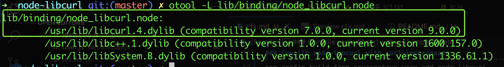
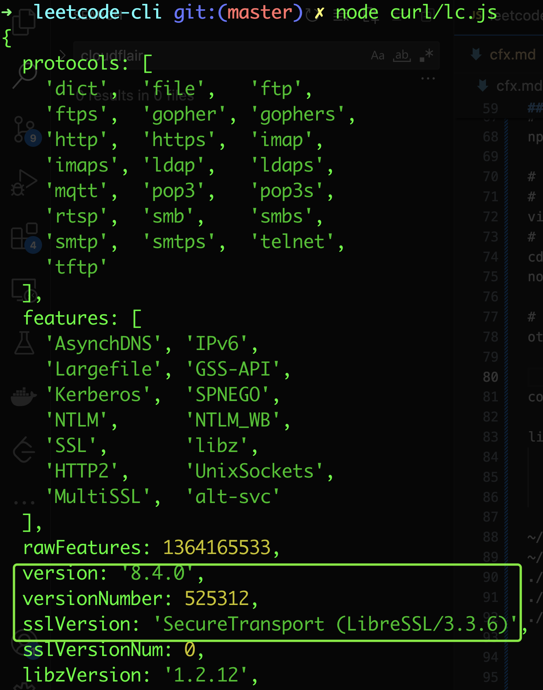

### About CloudFlare
#### What is Cloudflare Bot Management
Cloudflare is a web performance and security company. On the security side, they offer customers a [Web Application Firewall (WAF)](https://www.cloudflare.com/waf/). A WAF can defend applications against several security threats, such as cross-site scripting (XSS), credential stuffing, and DDoS attacks.

One of the core systems included in their WAF is Cloudflare's Bot Manager. As a bot protection solution, its main goal is to mitigate attacks from malicious bots without impacting real users.

About 1/5 of websites you need to scrape use Cloudflare, a hardcore anti-bot protection system that gets you blocked easily. 

#### How to bypass it?
Refer to [this question on stackoverflow](https://stackoverflow.com/questions/71529199/where-does-cloudflare-detect-web-and-terminal-requests-on-equal-terms),
Cloudflare uses various techniques to determine whether the user agent is a real browser or not. And, the site owner can also determine the level of risk they can allow via the Cloudflare platform.
Let's discuss a few techniques (I know) used by Cloudflare:
* TLS fingerprinting This is one of the prominent techniques used notoriously by Cloudflare. This is also the reason why tools like native proxy are popular. Link: https://github.com/klzgrad/naiveproxy
* Cookies Cloudflare used to have some cf_ related cookies which are used to distinguish real users or not.

And, these are only a few techniques. Cloudflare has many more.

After many tests, the proxy based solutions (naive, FlairSolverr) don't really work! The [curl-impersonate](https://github.com/lwthiker/curl-impersonate) based solution works well. This includes these steps:
* install curl-impersonate
* compile node-libcurl with curl-impersonate
* [test](curl/README.md)
* rewrite leetcode-cli to replace request with modified node-libcurl
* update the vscode leetcode plugin(extension) to use the enhanced leetcode-cli plugin

Finally, we use the curl_chrome116 command line + exec as the solution, because the NODE_MODULE_VERSION incompatibility issue in vscode. The vscode itself is built by electron, but we build the modified version of node-libcurl with node (18.12.0). Although in vscode leetcode extension, it spawns a separate node process (18.12.0) to run the underlying leetcode commands, we still got the NODE_MODULE_VERSION error.

```
const childProc = wsl.useWsl()
    ? cp.spawn("wsl", [leetCodeExecutor_1.leetCodeExecutor.node, leetCodeBinaryPath, "user", commandArg], { shell: true })
    : cp.spawn(leetCodeExecutor_1.leetCodeExecutor.node, [leetCodeBinaryPath, "user", commandArg], {
        shell: true,
        env: cpUtils_1.createEnvOption(),
    });

this.executeCommandEx(this.nodeExecutable, [yield this.getLeetCodeBinaryPath(), "plugin", "-e", plugin]);
```

### Install curl-impersonate
Refer to [INSTALL.md](https://github.com/lwthiker/curl-impersonate/blob/main/INSTALL.md#macos)
+ install prebuild binary through brew
```
brew tap shakacode/brew
brew install curl-impersonate
```
+ or compile & install from source code
```
# Install dependencies for building all the components:
brew install pkg-config make cmake ninja autoconf automake libtool
# For the Firefox version only
brew install sqlite nss
pip3 install gyp-next
# For the Chrome version only
brew install go

# Clone the repository
git clone https://github.com/lwthiker/curl-impersonate.git
cd curl-impersonate

# Configure and compile
mkdir build && cd build
../configure
# Build and install the Firefox version
gmake firefox-build
sudo gmake firefox-install
# Build and install the Chrome version
gmake chrome-build
sudo gmake chrome-install
# Optionally remove all the build files
cd ../ && rm -Rf build
```

### Compile node-libcurl with curl-impersonate
Build node-libcurl from source on macOS
```

# install the build tool node-gyp
npm i -g node-pre-gyp node-gyp 
# build & install node-libcurl from source, first time (to generate build files)
# npm_config_build_from_source=true npm i node-libcurl
# use yarn as npm doesn't create build folders and make files!
npm_config_build_from_source=true yarn add node-libcurl
npm_config_build_from_source=true npm_config_curl_static_build=false yarn add node-libcurl
# static build runs successfully, but got missing symbol(dyld) at runtime (TODO)
npm_config_build_from_source=true npm_config_curl_static_build=true yarn add node-libcurl

# got below error:
# npm ERR! clang: error: no such file or directory: '/usr/include'
# modify below make file and remove all /usr/include, save it
vi ./node_modules/node-libcurl/build/node_libcurl.target.mk

# for static build, got below errors:
# clang: error: no such file or directory: '/usr/lib/libcurl.@libext@'
# clang: error: no such file or directory: '@LDFLAGS@'
# clang: error: no such file or directory: '@LIBCURL_LIBS@'

# or we can do following tricks to "modify" curl-config
# because build/config.gypi & build/node_libcurl.target.mk are generated based on curl-config
cp /usr/bin/curl-config /usr/local/bin/curl-config
vi /usr/local/bin/curl-config
# modify & save, make sure /usr/local/bin is before /usr/bin in PATH env var
# reload the shell: source ~/.zshrc

# then build it again with node-gyp
cd ./node_modules/node-libcurl
node-gyp build

# verify the lib/binding/node_libcurl.node file
otool -L lib/binding/node_libcurl.node

lib/binding/node_libcurl.node:
	/usr/lib/libcurl.4.dylib (compatibility version 7.0.0, current version 9.0.0)
	/usr/lib/libc++.1.dylib (compatibility version 1.0.0, current version 1600.157.0)
	/usr/lib/libSystem.B.dylib (compatibility version 1.0.0, current version 1336.61.1)
```


```
# also noticed the reported version is changed
# console.log(Curl.getVersionInfo());
node curl/lc.js
```


```
# run test, it works!
node curl/lc.js

### questions ???
# otool -L node_modules/node-libcurl/lib/binding/node_libcurl.node
to find out which libcurl.4.dylib is loaded (as /usr/lib/libcurl.4.dylib doesn't exist!) ?
otool
lib/binding/node_libcurl.node:
	/usr/lib/libcurl.4.dylib (compatibility version 7.0.0, current version 9.0.0)

# DYLD_PRINT_LIBRARIES=1 node curl/lc.js
... ...
dyld[69574]: <4528259C-8493-3A0C-8B35-F29E87F59EED> /Users/harry/test/leetcode-cli/node_modules/node-libcurl/lib/binding/node_libcurl.node
dyld[69574]: <90815EBD-89C8-33E7-8B86-5A024176BC15> /usr/lib/libcurl.4.dylib
... ...
looks like macOS has some special mapping when loading /usr/lib/libcurl.4.dylib (in memory or cache?)

# references
# https://github.com/lwthiker/curl-impersonate
# https://github.com/lwthiker/curl-impersonate#libcurl-impersonate
# https://github.com/lwthiker/curl-impersonate/issues/80#issuecomment-1166192854
# https://github.com/JCMais/node-libcurl?tab=readme-ov-file#building-on-macos
```

### Test Conclusion
| Not working | Working     |
| ----------- | ----------- |
| original node-libcurl   | curl-impersonate              |
| naive proxy             | node exec + curl-impersonate  |
|                         | modified node-libcurl					|

### TODO
- Fix the NODE_MODULE_VERSION error by building node-libcurl [with electron](https://github.com/JCMais/node-libcurl?tab=readme-ov-file#electron-aka-atom-shell)
```
Failed to list problems: Error: The module '/Users/harry/.vscode/extensions/leetcode.vscode-leetcode-0.18.1/node_modules/vsc-leetcode-cli/node_modules/node-libcurl/lib/binding/node_libcurl.node' was compiled against a different Node.js version using NODE_MODULE_VERSION 108. This version of Node.js requires NODE_MODULE_VERSION 118. Please try re-compiling or re-installing the module (for instance, using `npm rebuild` or `npm install`)..
```
- Try different install locations for the node-libcurl

### Update the vscode leetcode extension

### References
- [Could not login with both 'leetcode user -l' and 'leetcode user -c'](https://github.com/skygragon/leetcode-cli/issues/218)
- [Cannot login with premium account](https://github.com/skygragon/leetcode-cli/issues/194)
- [Failed to log in with a leetcode.com account](https://github.com/LeetCode-OpenSource/vscode-leetcode/issues/478), [a comment](https://github.com/LeetCode-OpenSource/vscode-leetcode/issues/478#issuecomment-564757098)
- Proxy Server to bypass Cloudflare: [FlareSolverr](https://github.com/FlareSolverr/FlareSolverr), [naiveproxy](https://github.com/klzgrad/naiveproxy)
- [How To Bypass Cloudflare in 2024](https://scrapeops.io/web-scraping-playbook/how-to-bypass-cloudflare/)
- [How to Bypass Cloudflare in 2024: The 8 Best Methods](https://www.zenrows.com/blog/bypass-cloudflare)
- [How to bypass Cloudflare when web scraping in 2024](https://scrapfly.io/blog/how-to-bypass-cloudflare-anti-scraping/)
- [node abi versions](https://github.com/nodejs/node/blob/main/doc/abi_version_registry.json)

### Archived notes
```
# node-gyp related files:
~/Library/Caches/node-gyp/20.11.1/include/node/common.gypi
~/Library/Caches/node-gyp/20.11.1/include/node/config.gypi
./node_modules/node-gyp/addon.gypi
./node_modules/node-libcurl/build/config.gypi
./node_modules/node-libcurl/build/node_libcurl.target.mk

# other stuff (useless)
# no build running
npm install node-libcurl --verbose --build-from-source --curl_static_build=false --update-binary

# rebuild the node_libcurl.node binding
npm rebuild node-libcurl --update-binary

export @LDFLAGS@="-L/usr/local/lib -L$(xcrun --show-sdk-path)/usr/lib -L/usr/lib"
export @LIBCURL_LIBS@="-L/usr/local/opt/curl/lib"

export CFLAGS="-I/usr/local/include"
export CXXFLAGS="-I/usr/local/include"
export CPPFLAGS="-I/usr/local/include"
export LDFLAGS="-L/usr/local/lib -L/usr/local/Cellar/curl/0.6.0-alpha.1/lib"
export LIBRARY_PATH="/usr/local/lib -L/usr/local/Cellar/curl/0.6.0-alpha.1/lib"
$(xcrun --show-sdk-path)/usr/include
# Set environment variables for include and lib directories
export CURL_INCLUDE_DIR=/usr/local/Cellar/curl/8.6.0/include/curl
export CURL_LIB_DIR=/usr/local/Cellar/curl-impersonate/0.6.0-alpha.1/lib

# use the default macOS clang compiler! do NOT use other compilers
CC=gcc-13 CXX=g++-13 npm_config_build_from_source=true yarn add node-libcurl
CC=llvm-gcc CXX=llvm-g++ npm_config_build_from_source=true yarn add node-libcurl

npm install node-libcurl --build-from-source --curl_libraries='-Wl,-rpath /usr/local/lib -lcurl'
npm install node-libcurl --build-from-source --curl_libraries='-Wl,-rpath /usr/local/lib -lcurl-impersonate-chrome'

leetcode-cli locations:
- ~/.nvm/versions/node/v18.12.0/lib/node_modules/leetcode-cli-plugins
- ~/.nvm/versions/node/v18.12.0/lib/node_modules/vsc-leetcode-cli
- ~/.nvm/versions/node/v18.12.0/bin/leetcode
- ~/.vscode/extensions/leetcode.vscode-leetcode-0.18.1/
- ~/.vscode/extensions/leetcode.vscode-leetcode-0.18.1/node_modules/vsc-leetcode-cli/
```